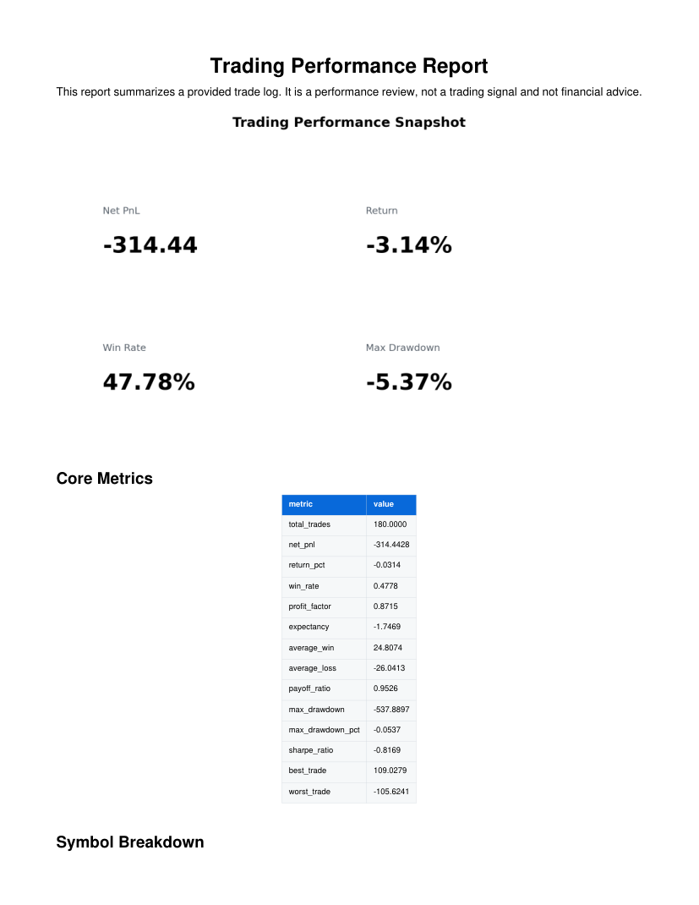
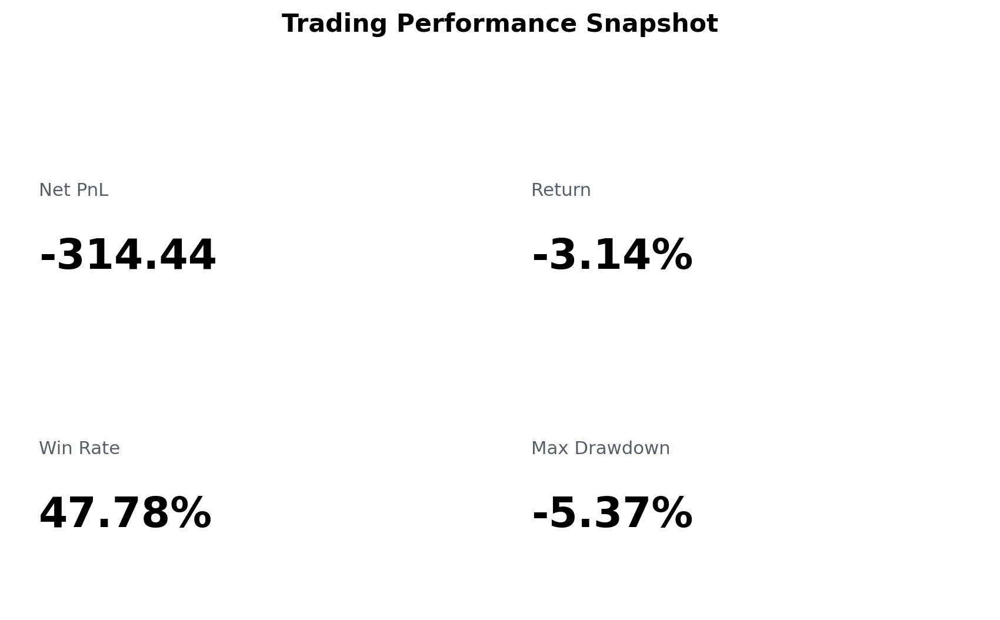
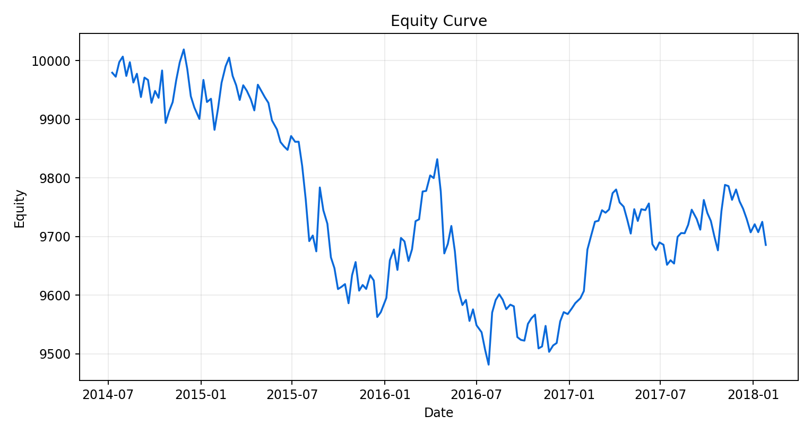
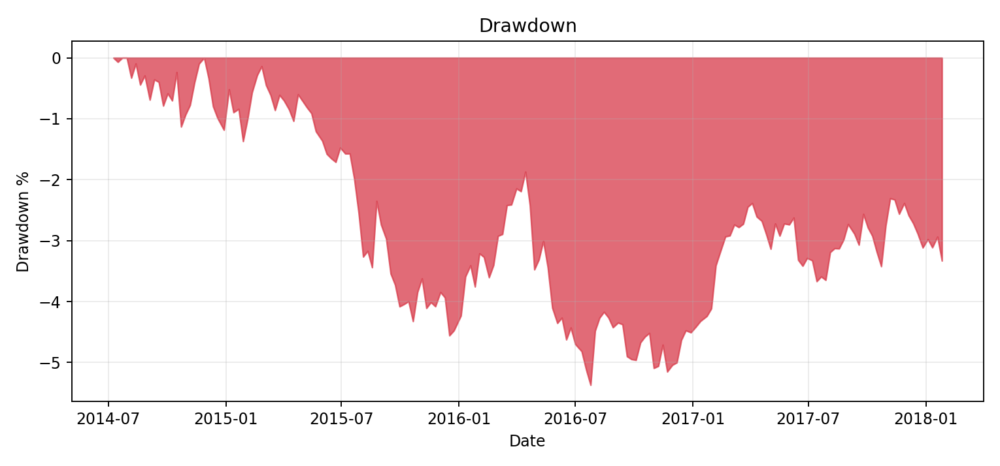
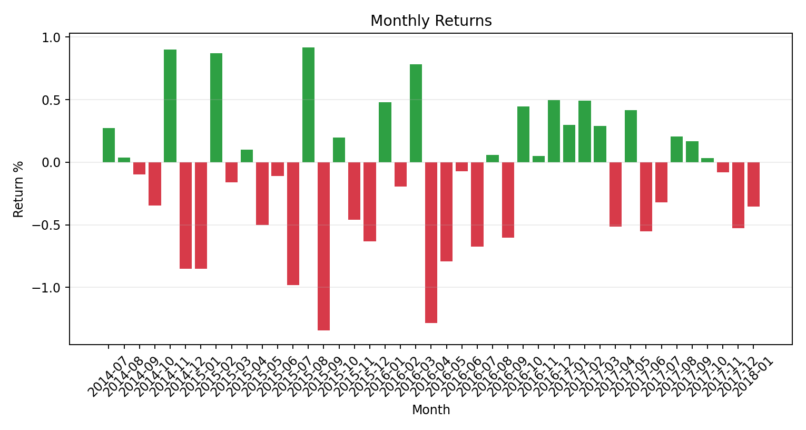

# Trading Performance Report Kit

[](https://github.com/emirhuseynrmx/trading-performance-report-kit/actions)
[](https://www.python.org/)

A small Python tool for turning a trade log into a performance report.

It reads a CSV of closed trades, checks the basic structure, calculates the usual trading metrics, and writes the result as CSV files, charts, and a PDF.

No signals, no prediction layer, no profit claim. The input is a trade history or backtest export that already exists.

## Input

Default columns:

```text
trade_id
symbol
side
entry_time
exit_time
entry_price
exit_price
quantity
fees
```

The column names can be changed in `examples/config.json`.

## Run

```bash
pip install -e ".[dev]"
trading-prepare-kaggle --out data/aapl_strategy_trades.csv
trading-report data/aapl_strategy_trades.csv --config examples/config.json --out outputs/aapl_report
```

The public sample is derived from a Kaggle AAPL OHLC dataset and converted into a closed-trade
ledger. The report never uses future prices for prediction; it only summarizes completed trades.

## Outputs

```text
performance_metrics.csv
trade_ledger.csv
daily_equity.csv
monthly_returns.csv
symbol_breakdown.csv
metrics_report.md
performance_report.pdf
dashboard.png
equity_curve.png
drawdown.png
monthly_returns.png
trade_distribution.png
manifest.json
```

Example outputs are in `sample_outputs/demo/`.

## Preview











## Metrics

The report includes:

- net PnL
- return %
- win rate
- profit factor
- expectancy
- average win and average loss
- payoff ratio
- max drawdown
- Sharpe ratio
- best and worst trade
- symbol breakdown
- monthly returns

## Notes

This is a reporting repo. It does not give financial advice and it does not say anything about future returns.

Backtests and trade logs can be misleading if fees, slippage, missing trades, survivorship bias, or overfitting are not handled correctly. The report is meant to make the trade history easier to inspect, not to prove that a strategy will keep working.
